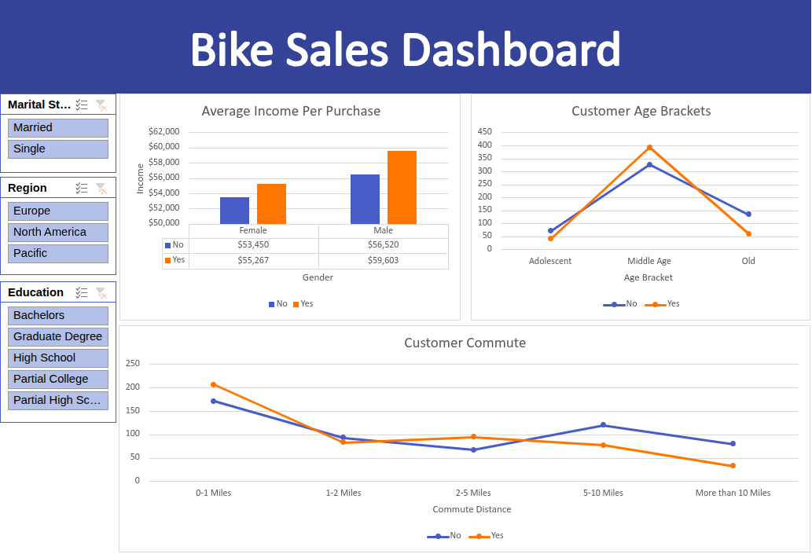

# Excel Data Analytics Dashboard

##  Overview
This project analyzes a sales/revenue dataset in Excel, from raw data cleanup through to a dashboard that summarizes performance and trends. It was completed as a hands-on project to build practical skills in data wrangling, formulas, and reporting.


##  Objective
Analyze sales performance to uncover trends in revenue, top-performing products/regions, and other patterns useful for business decision-making.

##  Tools & Skills Used
- Microsoft Excel
- Data cleaning (removing duplicates, handling blanks/errors, standardizing formats)
- Formulas: `SUM`, `IF`, `SUMIFS`, `COUNTIFS`, `AVERAGEIFS`
- PivotTables & PivotCharts
- Charts (bar & line) for visualizing sales trends
- Dashboard design for at-a-glance reporting

##  Data Cleaning Process
1. Imported the raw sales dataset
2. Removed duplicate and incomplete records
3. Standardized formatting (dates, currency, text case)
4. Organized data into a clean table structure for PivotTable analysis


##  Dashboard Features
- Summary KPIs (total revenue, total units sold, average order value)
- PivotTables summarizing sales by product/region/time period
- Charts showing revenue trends over time
- Breakdown of top-performing products or regions

##  Preview



##  Key Insights
- Which product or category generated the most revenue
- Which region or time period had the strongest/weakest sales
- Any notable trend over time (growth, seasonality, decline)

##  Repository Structure
```
sales-revenue-dashboard/
├── README.md
├── data/
│   └── raw_data.csv
│   └── clean_data.csv
│   └── pivot_table.csv
├── dashboard.csv
└── screenshots/
    └── dashboard.png
```

##  What I Learned
- Practiced structuring raw data for PivotTable analysis
- Used SUMIFS/COUNTIFS to summarize data by category
- Built a dashboard combining PivotTables and charts for clear, at-a-glance reporting

